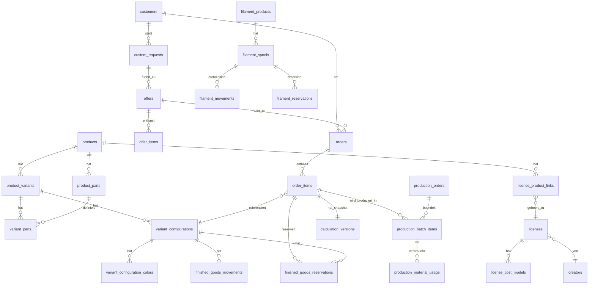

# 3D-Druck-Bestellplattform — Datenmodell v1 (Schritt 6)

Abgeleitet aus `3d-druck-projektstand-original.md` + `business-spezifikation-v2.md`.
Noch **kein** SQL/DDL — reines konzeptuelles Modell (Entitäten, Beziehungen, Schlüssel, Status, Historisierung). Technologieentscheidung (Schritt 7) kommt danach.

Konvention: Tabellennamen `snake_case`, `id` = surrogater Primärschlüssel (UUID empfohlen wegen verteilter Erzeugung/Concurrency), `*_id` = Fremdschlüssel. Zeitstempel `created_at` wird bei jeder Tabelle vorausgesetzt und unten nicht wiederholt aufgeführt, wenn nicht sonst relevant.

---

## 0. Grundentscheidungen, die das gesamte Modell prägen

1. **Kein Soft-Delete-Flag reicht allein nicht** — für Bestellungen/Positionen/Produktionsaufträge gilt: Status ist immer ein Endzustand (`Cancelled`, `Storniert`, `Fehlgeschlagen`), nie ein physisches Löschen. Für Stammdaten (Produkte, Filamente, Drucker, Farben/Finishes) gilt `active = false` statt Löschen (Prinzip #2).
2. **Reservierung = eigene Tabelle mit Status, nicht nur ein Zähler.** Ein reiner `reserved_qty`-Zähler auf einer Bestandstabelle ist zwar performant, aber selbst nicht auditierbar und anfällig für Update-Anomalien bei Nebenläufigkeit. Deshalb: Bestand = Ledger (Bewegungen) + Reservierungstabelle mit Status; ein aktueller Bestandswert ist eine **Ableitung** (View/Materialized View), keine eigenständige Wahrheit.
3. **Kalkulation ist ein Snapshot, kein Verweis.** `calculation_versions` kopiert alle Kostenkomponenten zum Zeitpunkt der Berechnung (keine Live-FKs auf aktuelle Filamentpreise etc.), damit Prinzip #9 (alte Bestellungen ändern sich nicht) strukturell garantiert ist.
4. **Audit Log ist generisch und zentral** (eine Tabelle für alle Entitäten), ergänzt um wenige denormalisierte Zeitstempel-Spalten direkt auf `orders` für schnelle Abfragen (`confirmed_at`, `handed_over_at` etc.). Keine parallelen Status-Historientabellen pro Entität — das wäre Redundanz ohne Mehrwert.
5. **Konfigurationen (Variante + Farbe/Finish je Teil) sind eine eigene Entität** (`variant_configurations`), damit mehrfarbige Produkte, Fertigwarenbestand und Bestellpositionen dieselbe Struktur referenzieren, statt Farbfelder mehrfach zu duplizieren.

---

## 1. Produkte, Varianten, Teile, Farben

### `products`
| Feld | Typ | Hinweis |
|---|---|---|
| id | PK | |
| name, description, category | | |
| images | JSON-Array | Format: `[{url: string, source_type: 'extern_link' \| 'eigenes_hosting'}]` |
| active | bool | nie löschen (Prinzip #2) |
| is_multicolor | bool | steuert, ob Farbwahl pro Teil oder pro Position erfolgt |
| license_id | FK → `licenses`, nullable | |
| source_custom_request_id | FK → `custom_requests`, nullable | falls aus individueller Anfrage entstanden (§3-Originaldoc) |
| created_at, updated_at | | |

### `product_variants`
| Feld | Typ | Hinweis |
|---|---|---|
| id | PK | |
| product_id | FK → products | |
| size_label | z. B. "15 cm" | |
| weight_g, print_time_min, work_time_min, material_need_g | | Summe aus `variant_parts`, siehe unten — bei Produkten ohne Teile direkt gepflegt |
| min_qty, max_qty, step_qty | | Mengenregeln §6 |
| active | bool | |

### `product_parts` (Teil-**Definition**, z. B. "Kopf", "Body")
| id PK | product_id FK | name | sort_order |

### `variant_parts` (Teil-**Werte je Variante**, da Größe die Teilwerte beeinflusst)
| id PK | variant_id FK | product_part_id FK | weight_g | print_time_min | material_need_g |

→ `product_variants.weight_g` etc. sind bei Produkten mit Teilen **berechnete Summen** (Anwendungsschicht oder DB-View), keine unabhängige Wahrheit — verhindert Divergenz.

### `colors` / `finishes`
Einfache Stammdaten: `id, name, hex (nullable, nur colors), active`.

### `product_color_finish_options`
Erlaubte Kombinationen **pro Produkt** (nicht pro Teil — die Teile wählen aus derselben Liste, §3.1):
| id PK | product_id FK | color_id FK | finish_id FK | active |

### `variant_configurations` (die eigentliche "verkaufbare/lagerbare Ausprägung")
| id PK | variant_id FK |

### `variant_configuration_colors`
| id PK | variant_configuration_id FK | product_part_id FK **nullable** (NULL = gilt für die ganze Position, bei nicht-mehrfarbigen Produkten) | color_id FK | finish_id FK |

Eine `variant_configuration` mit einer Zeile ohne `product_part_id` = einfarbiges Produkt. Mehrere Zeilen mit `product_part_id` gesetzt = mehrfarbiges Produkt (Kopf-Farbe, Fuß-Farbe getrennt). Diese Struktur wird sowohl von `order_items` als auch von `finished_goods_stock` referenziert → keine doppelte Farblogik.

### `product_bundles` / `bundle_items`
| `product_bundles`: id PK, name, fixed_price, active |
| `bundle_items`: id PK, bundle_id FK, product_id FK | *(Variante/Farbe wählt der Kunde je enthaltenem Produkt frei zum Bestellzeitpunkt — daher hier keine feste Variante hinterlegt, siehe §3.1)*

---

## 2. Filament (Material)

### `filament_products` (Referenz-/Typkatalog)
| id PK | manufacturer | product_name | material | color_id FK | finish_id FK | diameter_mm | print_temp_c | bed_temp_c | print_profile | active |

### `filament_spools` (konkrete Rolle = eigenes Inventarobjekt, §3.3)
| id PK | filament_product_id FK | purchase_price | initial_weight_g (**gewogen**, nicht Herstellerangabe) | tare_weight_g | purchase_date | active |

### `filament_movements` (Bewegungsprotokoll, §14)
| id PK | spool_id FK | movement_type enum(`einkauf`, `produktion`, `fehldruck`, `korrektur`, `sonstige`) | amount_g (± signed) | reference_type/reference_id (z. B. `production_batch_item`) | note | created_by | created_at |

Restbestand einer Spule = `initial_weight_g + Σ(movements.amount_g)` (Anbruch-Wiegung ist der Nullpunkt; Korrekturbewegungen gleichen Drift aus §3.3).

### `filament_reservations` (§13 — **erst bei Produktionsstart**, nie bei Bestellannahme)
| id PK | spool_id FK | order_item_id FK | production_batch_item_id FK nullable | amount_g | status enum(`aktiv`, `freigegeben`, `verbraucht`) | created_at | released_at nullable |

Verfügbar je Spule = `Restbestand − Σ(amount_g WHERE status='aktiv')`. Eine Reservierung wird nur angelegt, wenn `amount_g ≤ verfügbar` — **alles-oder-nichts**, keine Teilreservierung (§3.17). Konkrete Umsetzung: Transaktion mit Zeilensperre (`SELECT … FOR UPDATE`) auf die Spule oder ein Constraint, der negative Verfügbarkeit verhindert — Technologiedetail für Schritt 7, aber das Reservierungsmodell selbst erzwingt es bereits strukturell.

---

## 3. Fertigwarenbestand

### `finished_goods_movements`
| id PK | variant_configuration_id FK | stock_type enum(`normal`, `b_ware`) | movement_type enum(`produktion_erfolgreich`, `uebergabe`, `korrektur`, `ausschuss_umbuchung`, `sonstige`) | qty_delta (±) | reference_type/reference_id | created_by | created_at |

### `finished_goods_reservations` (§17 — **sofort bei `Confirmed`**)
| id PK | variant_configuration_id FK | stock_type | order_item_id FK | qty | status enum(`aktiv`, `freigegeben`, `verbraucht_bei_uebergabe`) | created_at | released_at nullable |

Aktueller Bestand je Konfiguration/Typ = `Σ(finished_goods_movements.qty_delta)`. Verfügbar = Bestand − `Σ(reservations WHERE status='aktiv')`. Bei `Handed Over`: Reservierung → `verbraucht_bei_uebergabe`, zusätzlich `finished_goods_movements`-Eintrag `uebergabe` (qty_delta negativ) — endgültige Entnahme aus dem Bestand (§3.14, Prinzip: Statuswechsel + Lagerbewegung atomar).

B-Ware entsteht durch `ausschuss_umbuchung` (+ in `stock_type='b_ware'`), Quelle ist ein Ausschuss-Eintrag in `production_batch_items` — getrennter Bestandstyp, getrennt verkaufbar (§3.5).

---

## 4. Kunden, Warenkorb, Tracking

### `customers`
| id PK (= interne Kundennummer, §3.8) | first_name | last_name | email nullable | phone nullable | pickup_method | anonymize_after (date) | anonymized_at nullable | created_at |

Kein Dedup über E-Mail solange optional (§3.8) — bewusst kein UNIQUE-Constraint auf `email`.

### `cart_sessions` / `cart_items`
Bewusste **Ausnahme** von "nie löschen": Der Warenkorb ist vor-transaktionaler, technischer Zustand ohne Geschäftswert (§18: Warenkorb ≠ Reservierung) — abgelaufene Sessions dürfen technisch aufgeräumt/expired werden, das betrifft kein Historisierungsprinzip.
| `cart_sessions`: id PK, session_token, expires_at |
| `cart_items`: id PK, cart_session_id FK, product_id FK, variant_id FK, configuration_draft (JSON: gewählte Farbe/Finish je Teil, noch keine feste `variant_configuration_id`, da rein clientseitiger Entwurf), qty |

### `order_tracking_tokens`
| id PK | order_id FK | token (unique, secure random) | expires_at | revoked_at nullable | revoke_reason nullable |

Neugenerierung bei Missbrauchsverdacht = neue Zeile, alte wird `revoked_at` gesetzt statt gelöscht (Nachvollziehbarkeit, kein Datenverlust).

---

## 5. Individuelle Anfragen & Angebote

### `custom_requests`
| id PK | customer_id FK | makerworld_link | own_image | desired_size | color_id FK nullable | finish_id FK nullable | qty | message | status enum(`neu`,`geprueft`,`angebot_erstellt`,`abgelehnt`) |

### `offers`
| id PK | custom_request_id FK | valid_from | valid_until | status enum(`offen`,`akzeptiert`,`abgelehnt`,`abgelaufen`) | secure_token | rejection_reason nullable |

### `offer_items`
| id PK | offer_id FK | product_id FK nullable (ggf. noch kein Katalogprodukt) | desired_variant_description | qty | calculation_version_id FK |

Mehrfach nutzbarer Link (§3.9): jede Nutzung prüft Verfügbarkeit neu zum Zeitpunkt der Bestellauslösung — das ist Anwendungslogik gegen `finished_goods`/`filament`-Verfügbarkeit, keine zusätzliche Tabelle nötig. Jede Angebotsänderung → neue Zeile in `calculation_versions`, alte bleibt verknüpft an vergangene `offer_items`-Historie (siehe Audit Log).

---

## 6. Bestellungen

### `orders`
| Feld | Hinweis |
|---|---|
| id PK, order_number (z. B. `ORDER-2026-00142`, unique) | |
| customer_id FK | |
| status enum(`New`,`Confirmed`,`InProduction`,`Finished`,`ReadyForPickup`,`HandedOver`,`Cancelled`) | |
| source enum(`catalog`,`custom_offer`) | |
| offer_id FK nullable | |
| customer_message, internal_note | strikt getrennte Felder (§36) |
| cancellation_reason nullable | Pflicht bei `Cancelled` (§3.17/Prinzip #32) |
| confirmed_at, finished_at, ready_for_pickup_at, handed_over_at nullable | denormalisierte Bequemlichkeits-Zeitstempel, volle Historie im Audit Log |
| handed_over_by FK → admins, handover_note nullable | §51 |

### `order_items` (Bestellpositionen, §24)
| Feld | Hinweis |
|---|---|
| id PK, order_id FK | |
| product_id FK, variant_id FK, variant_configuration_id FK | Farbe/Finish über Konfiguration, nicht als Freitext |
| qty | |
| status enum(`Offen`,`WartetAufMaterial`,`InProduktion`,`Fertig`,`Storniert`) | |
| cancellation_reason nullable | Pflicht bei `Storniert` |
| calculation_version_id FK | Preis-/Kosten-Snapshot zum Bestellzeitpunkt |
| bundle_group_id FK nullable → `order_bundle_groups` | |

### `order_bundle_groups`
| id PK | order_id FK | bundle_id FK | bundle_price (überschreibt Summe der Einzelpositionen) |

---

## 7. Produktion

### `production_orders`
| id PK | printer_id FK nullable | status enum(`Geplant`,`Laeuft`,`Abgeschlossen`,`Fehlgeschlagen`) | planned_start, actual_start, actual_end nullable |

### `production_batch_items` (Batch-Zuordnung, §3.4/§25)
| Feld | Hinweis |
|---|---|
| id PK, production_order_id FK, order_item_id FK | ein Produktionsauftrag kann mehrere Positionen bündeln |
| qty_planned | |
| qty_success | zählt als Fortschritt |
| qty_scrap_normal | regulärer Ausschuss |
| qty_scrap_complaint | reklamationsbedingte Ersatzproduktion — **eigener Grund-Typ** (§3.12, Prinzip #28) |

Bei Totalausfall des ganzen Batches wird `qty_scrap_normal` anteilig nach geplantem Materialbedarf auf die beteiligten `production_batch_items` verteilt (Anwendungslogik zum Zeitpunkt des Abschlusses, keine zusätzliche Tabelle).

### `production_material_usage` (tatsächlicher Verbrauch je Position, auch bei Batch)
| id PK | production_batch_item_id FK | spool_id FK | amount_g | filament_movement_id FK | created_at |

→ verknüpft `production_batch_items` mit dem entsprechenden `filament_movements`-Eintrag; ermöglicht "geplant 656 g / reserviert 656 g / tatsächlich 827 g" nebeneinander (Planung: `variant_parts.material_need_g × qty`; Reservierung: `filament_reservations`; Realität: `production_material_usage`).

### `printers`
| id PK | name | model | power_consumption_w | machine_hour_rate | active |

### `complaints` (Reklamationen, §3.12)
| id PK | order_item_id FK | reported_at | reason | decision enum(`ersatzproduktion`,`rueckerstattung`,`sonstige`) | decision_note | cost | resolved_at | replacement_production_batch_item_id FK nullable | created_by |

---

## 8. Kalkulation

### `calculation_versions`
| Feld | Hinweis |
|---|---|
| id PK | |
| scope_type enum(`product_variant`,`offer_item`) , scope_id | worauf sich diese Version bezieht |
| version_no | fortlaufend je scope |
| reason enum(`kundenwunsch`,`admin_korrektur`,`falsche_variante`,`sonstiger_grund`) | Pflicht bei Änderung (§30) |
| filament_cost, energy_cost, machine_cost, labor_cost, packaging_cost, license_cost, scrap_allowance, other_cost, total_cost | **kopierte Werte**, keine Live-Referenzen |
| margin_percent, min_price | |
| calculated_price | automatisch berechnet, aufgerundet auf nächsten `.49`/`.99` (§3.13) |
| final_price | ggf. manuell überschrieben — **beide Werte bleiben erhalten** (§47) |
| is_current | bool, nur für `product_variant`-Scope zur Anzeige des aktuell gültigen Katalogpreises |
| created_by, created_at | |

`order_items.calculation_version_id` verweist immer auf eine **konkrete, unveränderliche** Version — spätere Preisänderungen am Produkt erzeugen neue Versionen, alte Bestellungen bleiben unberührt (Prinzip #9).

*Tatsächliche* Kosten (vs. kalkulierte) sind kein eigenes Snapshot-Feld, sondern zur Auswertungszeit aus `production_material_usage` + `filament_movements` + `production_batch_items.qty_scrap_*` ableitbar — Reporting/Statistik-Query, keine zusätzliche Tabelle nötig (vermeidet zweite Wahrheit).

---

## 9. Lizenzen

### `creators`
| id PK | name | profile_url (unique) |

### `licenses` (Lizenzrecht)
| id PK | creator_id FK | commercial_use_allowed bool | valid_from, valid_until nullable | status enum(`aktiv`,`abgelaufen`,`widerrufen`) | proof_note | source |

### `license_product_links` (eine Lizenz kann mehrere Modelle desselben Creators abdecken, §3.7)
| id PK | license_id FK | product_id FK |

### `license_cost_models` (Lizenzkosten — getrennt vom Recht, §43)
| id PK | license_id FK | cost_type enum(`kostenlos`,`pro_stueck`,`einmalig`,`wiederkehrend`,`sonstige`) | amount | period nullable (z. B. `monatlich`) |

### `license_recurring_charges` (§45 — tatsächliche Zahlung vs. kalkulatorische Umlage getrennt)
| id PK | license_id FK | period_start, period_end | amount_paid | allocated_qty | per_unit_allocated_cost | created_at |

---

## 10. Querschnitt: Audit Log & Settings

### `audit_log`
| id PK | entity_type | entity_id | action | field_name nullable | old_value, new_value | reason nullable | actor (admin_id nullable oder `'system'`) | created_at |

Deckt **alle** Statuswechsel und relevanten Feldänderungen entityübergreifend ab (§3.17, §37) — wird nie überschrieben oder gelöscht.

### `settings` (Key-Value oder Spaltentabelle)
`email_system_enabled`, `email_required_at_order` (Default: aus, §3.8), `electricity_price_per_kwh`, `default_labor_rate_per_hour`, `min_order_value` (falls später aktiviert).

### `admins`
Nur ein Account laut Spezifikation, aber als Tabelle modelliert (nicht hart codiert), damit spätere Rollenverwaltung ohne Umbau möglich ist: `id PK, email (unique), password_hash, active`.

---

## 11. Vereinfachtes Beziehungsdiagramm (Kernfluss)

---

## 12. Prüfung gegen die Architekturprinzipien (§66 + §5 v2-Dokument)

| # | Prinzip | Umsetzung im Modell |
|---|---|---|
| 1 | Historische Daten nie zerstören | Nur Status-Endzustände, kein DELETE auf Geschäftsdaten; Ausnahme bewusst nur `cart_sessions` |
| 2 | Produkte deaktivieren statt löschen | `active`-Flag auf `products`, `product_variants`, `filament_products`, `printers`, `colors`, `finishes` |
| 3 | Planung ≠ Reservierung ≠ Realität | Planung = `variant_parts.material_need_g`; Reservierung = `filament_reservations`/`finished_goods_reservations`; Realität = `filament_movements`/`production_material_usage`/`production_batch_items.qty_success` |
| 4 | Tatsächlichen Verbrauch nachvollziehbar | `filament_movements` + `production_material_usage`, nie überschrieben |
| 5 | Reservierungen concurrency-safe | Reservierung = eigene Zeile, nicht Zähler-Update; verfügbare Menge wird transaktional gegen `Σ(status='aktiv')` geprüft (Sperre/Constraint in Schritt 7 zu spezifizieren) |
| 6 | Kunde sieht nie interne Kosten | Kosten-Felder in `calculation_versions` nur adminseitig lesbar (Zugriffskontrolle = Schritt 7/RLS); Tracking zeigt nur `final_price` |
| 7 | Interne Notizen nie öffentlich | `orders.internal_note` getrennt von `customer_message` |
| 8 | Kalkulationen versionieren | `calculation_versions` mit `version_no`, nie Update, nur Insert |
| 9 | Alte Bestellungen unveränderlich bei neuen Preisen | `order_items.calculation_version_id` fix, Werte in `calculation_versions` sind Kopien |
| 10 | Farbe ≠ konkretes Filament | `colors`/`finishes` (Kundensicht) vs. `filament_products`/`filament_spools` (interne Realisierung), verbunden nur über Produktions-Zuordnung |
| 11 | Lizenzrecht ≠ Lizenzkosten | `licenses` (Recht) vs. `license_cost_models` (Kosten) getrennte Tabellen |
| 12 | Fertigwaren- ≠ Filamentbestand | vollständig getrennte Tabellenpaare (`finished_goods_*` vs. `filament_*`) |
| 13 | Bestellung ≠ Produktionsfortschritt | `order_items.status` (Kundensicht) vs. `production_batch_items`/`production_orders.status` (Produktionssicht) getrennt |
| 14 | Warenkorb reserviert keinen Bestand | `cart_items` hat keine Verbindung zu `*_reservations` |
| 15 | Mehrpositions-Bestellannahme atomar | Anlage von `order` + allen `order_items` + zugehörigen `finished_goods_reservations` in einer Transaktion; Rollback bei Teilscheitern (Anwendungslogik, durch Reservierungsmodell strukturell ermöglicht) |
| 16 | E-Mail nicht geschäftskritisch | keine E-Mail-Tabelle koppelt an Statuswechsel-Transaktionen; separates `email_log` (optional, hier nicht im Kern modelliert) wäre rein protokollierend |
| 17 | MVP einfach, aber erweiterbar | z. B. `admins` als Tabelle trotz nur einem Account; `settings.email_required_at_order` vorbereitet |
| 18 | Keine automatische Filamentauswahl | `filament_reservations.spool_id` wird nur durch Admin-Aktion gesetzt, kein Trigger wählt automatisch |
| 19 | Keine automatische Stornierung nicht abgeholter Bestellungen | kein Scheduler/Job im Modell vorgesehen |
| 20 | Keine Teilabholung im MVP | `orders.status → ReadyForPickup` nur wenn alle aktiven `order_items` fertig (Anwendungslogik) |
| 21 | Keine Kundenkonten im MVP | `customers` ohne Login-Feld/Passwort |
| 22 | Keine Onlinezahlung im MVP | kein `payments`-Modell, aber `orders` prinzipiell erweiterbar (kein Blocker) |
| 23 | Kein Versand im MVP | kein `shipments`-Modell; `customers.pickup_method` als einziges Feld, spätere Erweiterung ohne Bruch möglich |
| 24 | Produktteile eigene Entität | `product_parts`/`variant_parts` |
| 25 | Produktionsauftrag bündelt mehrere Positionen | `production_batch_items` als n:m-Verbindung |
| 26 | Bundles rein organisatorisch | `order_bundle_groups` erzeugt keine eigene Lager-/Produktionslogik, referenziert nur normale `order_items` |
| 27 | Jede Angebotsänderung neue Kalkulationsversion | `calculation_versions.version_no`, nie Update |
| 28 | Reklamationsersatzproduktion getrennt von Ausschuss | `production_batch_items.qty_scrap_complaint` vs. `qty_scrap_normal` |
| 29 | Verkaufspreise immer aufgerundet | `calculation_versions.calculated_price`-Berechnungslogik (Anwendungsschicht, Regel hier dokumentiert) |
| 30 | Fertigware sofort, Material erst bei Produktionsstart reserviert | zeitlich getrennte Tabellen `finished_goods_reservations` (bei `Confirmed`) vs. `filament_reservations` (bei `InProduktion`) |
| 31 | Statuswechsel + Folgeaktionen atomar, Rollback bei Fehlschlag | alle Statusänderung + zugehörige Reservierungs-/Bewegungs-/Audit-Log-Einträge in einer DB-Transaktion (Anwendungsschicht-Vorgabe, durch Tabellenschnitt so vorgesehen) |
| 32 | Stornierungsgrund Pflicht auf Positions- und Bestellungsebene | `order_items.cancellation_reason`, `orders.cancellation_reason` |

**Ergebnis:** Alle 32 Prinzipien sind strukturell im Modell abgebildet oder als explizite Anwendungslogik-Vorgabe benannt (v. a. #15, #29, #31 sind Transaktions-/Berechnungslogik, keine reinen Tabellenfragen — das ist normal und wird in Schritt 7/9 konkretisiert).

---

## 13. Offene Punkte für Schritt 7 (Architektur/Technologie)

- Konkrete Concurrency-Strategie für Reservierungen: `SELECT … FOR UPDATE` vs. Serializable-Transaktionen vs. DB-Constraint — hängt von Supabase/Postgres-Entscheidung ab.
- RLS-Policies pro Tabelle (wer darf `internal_note`, `calculation_versions`, `filament_spools.purchase_price` lesen).
- Materialisierte Bestands-Views (`finished_goods_stock`, `filament_stock`) vs. Berechnung zur Laufzeit — Performance-Frage.
- `email_log`-Tabelle (optional) für Nachvollziehbarkeit von E-Mail-Versand, ohne Kopplung an Geschäftstransaktionen.
- Indexierung: v. a. Teilindizes auf `status = 'aktiv'` bei den Reservierungstabellen.
